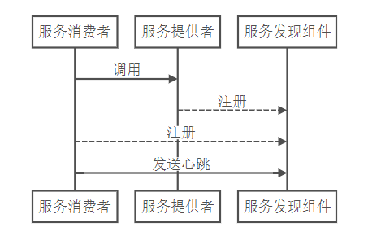
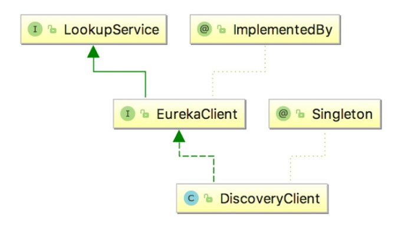

# Eureka源码

## Eureka服务的操作:

**register服务注册**：当Eureka客户端向Eureka Server注册时，它提供自身的元数据，比如IP地址、端口，运行状况指示符URL，主页等。

  
 

**renew服务续约**：Eureka客户会每隔30秒发送一次心跳来续约。 通过续约来告知Eureka Server该Eureka客户仍然存在，没有出现问题。 正常情况下，如果Eureka Server在90秒没有收到Eureka客户的续约，它会将实例从其注册表中删除。 建议不要更改续约间隔。

**fetch register获取服务注册信息**：Eureka客户端从服务器获取注册表信息，并将其缓存在本地。客户端会使用该信息查找其他服务，从而进行远程调用。该注册列表信息定期（每30秒钟）更新一次。每次返回注册列表信息可能与Eureka客户端的缓存信息不同， Eureka客户端自动处理。如果由于某种原因导致注册列表信息不能及时匹配，Eureka客户端则会重新获取整个注册表信息。 Eureka服务器缓存注册列表信息，整个注册表以及每个应用程序的信息进行了压缩，压缩内容和没有压缩的内容完全相同。Eureka客户端和Eureka 服务器可以使用JSON / XML格式进行通讯。在默认的情况下Eureka客户端使用压缩JSON格式来获取注册列表的信息。

**cancel服务下线**：Eureka客户端在程序关闭时向Eureka服务器发送取消请求。 发送请求后，该客户端实例信息将从服务器的实例注册表中删除。

**eviction服务剔除**：在默认的情况下，当Eureka客户端连续90秒没有向Eureka服务器发送服务续约，即心跳，Eureka服务器会将该服务实例从服务注册列表删除，即服务剔除。

## Register服务注册

服务注册，即Eureka Client向Eureka Server提交自己的服务信息，包括IP地址、端口、service ID等信息。如果Eureka Client没有写service ID，则默认为 ${[spring.application.name](http://spring.application.name/)}。

com.netflix.discovery包下的DiscoveryClient类，该类包含了Eureka Client向Eureka Server的相关方法。

~~~java
@Singleton
public class DiscoveryClient implements EurekaClient {}
~~~

  
 

~~~java
    boolean register() throws Throwable {
        logger.info("DiscoveryClient_{}: registering service...", this.appPathIdentifier);

        EurekaHttpResponse httpResponse;
        try {
            //使用HTTP的方式注册服务
            httpResponse = this.eurekaTransport.registrationClient.register(this.instanceInfo);
        } catch (Exception var3) {
            logger.warn("DiscoveryClient_{} - registration failed {}", new Object[]{this.appPathIdentifier, var3.getMessage(), var3});
            throw var3;
        }
        if (logger.isInfoEnabled()) {
            logger.info("DiscoveryClient_{} - registration status: {}", this.appPathIdentifier, httpResponse.getStatusCode());
        }

        return httpResponse.getStatusCode() == 204;
    }
~~~

$$
@Deprecated  接口过时，需要声明新的接口名称和地址
$$

$$
@Inject在构造方法上使用 @Inject 时，其参数在运行时由配置好的IoC容器提供。(因为JRE无法决定构造方法注入的优先级，所以规范中规定类中只能有一个构造方法带@Inject注解)
$$

在DiscoveryClient类继续追踪register()方法，它被InstanceInfoReplicator 类的run()方法调用，其中InstanceInfoReplicator实现了Runnable接口

~~~java
    public void run() {
        boolean var6 = false;

        ScheduledFuture next;
        label53: {
            try {
                var6 = true;
                this.discoveryClient.refreshInstanceInfo();
                Long dirtyTimestamp = this.instanceInfo.isDirtyWithTime();
                if (dirtyTimestamp != null) {
                    this.discoveryClient.register();
                    this.instanceInfo.unsetIsDirty(dirtyTimestamp);
                    var6 = false;
                } else {
                    var6 = false;
                }
                break label53;
            } catch (Throwable var7) {
                logger.warn("There was a problem with the instance info replicator", var7);
                var6 = false;
            } finally {
                if (var6) {
                    ScheduledFuture next = this.scheduler.schedule(this, (long)this.replicationIntervalSeconds, TimeUnit.SECONDS);
                    this.scheduledPeriodicRef.set(next);
                }
            }

            next = this.scheduler.schedule(this, (long)this.replicationIntervalSeconds, TimeUnit.SECONDS);
            this.scheduledPeriodicRef.set(next);
            return;
        }

~~~

在服务注册的过程中需要向Server服务器进行续约

~~~java
    private void initScheduledTasks() {
        int renewalIntervalInSecs;
        int expBackOffBound;
        if (this.clientConfig.shouldFetchRegistry()) {
            renewalIntervalInSecs = this.clientConfig.getRegistryFetchIntervalSeconds();
            expBackOffBound = this.clientConfig.getCacheRefreshExecutorExponentialBackOffBound();
            this.scheduler.schedule(new TimedSupervisorTask("cacheRefresh", this.scheduler, this.cacheRefreshExecutor, renewalIntervalInSecs, TimeUnit.SECONDS, expBackOffBound, new DiscoveryClient.CacheRefreshThread()), (long)renewalIntervalInSecs, TimeUnit.SECONDS);
        }

        if (this.clientConfig.shouldRegisterWithEureka()) {
            renewalIntervalInSecs = this.instanceInfo.getLeaseInfo().getRenewalIntervalInSecs();
            expBackOffBound = this.clientConfig.getHeartbeatExecutorExponentialBackOffBound();
            logger.info("Starting heartbeat executor: renew interval is: {}", renewalIntervalInSecs);
            this.scheduler.schedule(new TimedSupervisorTask("heartbeat", this.scheduler, this.heartbeatExecutor, renewalIntervalInSecs, TimeUnit.SECONDS, expBackOffBound, new DiscoveryClient.HeartbeatThread()), (long)renewalIntervalInSecs, TimeUnit.SECONDS);
            this.instanceInfoReplicator = new InstanceInfoReplicator(this, this.instanceInfo, this.clientConfig.getInstanceInfoReplicationIntervalSeconds(), 2);
            this.statusChangeListener = new StatusChangeListener() {
                public String getId() {
                    return "statusChangeListener";
                }

                public void notify(StatusChangeEvent statusChangeEvent) {
                    if (InstanceStatus.DOWN != statusChangeEvent.getStatus() && InstanceStatus.DOWN != statusChangeEvent.getPreviousStatus()) {
                        DiscoveryClient.logger.info("Saw local status change event {}", statusChangeEvent);
                    } else {
                        DiscoveryClient.logger.warn("Saw local status change event {}", statusChangeEvent);
                    }

                    DiscoveryClient.this.instanceInfoReplicator.onDemandUpdate();
                }
            };
            if (this.clientConfig.shouldOnDemandUpdateStatusChange()) {
                this.applicationInfoManager.registerStatusChangeListener(this.statusChangeListener);
            }

            this.instanceInfoReplicator.start(this.clientConfig.getInitialInstanceInfoReplicationIntervalSeconds());
        } else {
            logger.info("Not registering with Eureka server per configuration");
        }
    }
~~~

使用`ScheduledExecutorService`来定时获取注册列表

在server端，先追踪PeerAwareInstanceRegistryImpl类，在该类的register()方法，该方法提供了注册，并且将注册后信息同步到其他的Eureka Server服务。

~~~java
    public void register(InstanceInfo info, boolean isReplication) {
        int leaseDuration = 90;
        if (info.getLeaseInfo() != null && info.getLeaseInfo().getDurationInSecs() > 0) {
            leaseDuration = info.getLeaseInfo().getDurationInSecs();
        }
        super.register(info, leaseDuration, isReplication);
        this.replicateToPeers(PeerAwareInstanceRegistryImpl.Action.Register, info.getAppName(), info.getId(), info, (InstanceStatus)null, isReplication);
    }
~~~

点击进入子类中，我们会发现Eureka将发现的服务存入Map中。map是通过`ConcurrentHashMap`存储的各个客户端注册的服务，其中key为注册服务的AppName，value为其中注册的服务信息的map

~~~java
            this.read.lock();
            Map<String, Lease<InstanceInfo>> gMap = (Map)this.registry.get(registrant.getAppName());
            EurekaMonitors.REGISTER.increment(isReplication);
            if (gMap == null) {
                ConcurrentHashMap<String, Lease<InstanceInfo>> gNewMap = new ConcurrentHashMap();
                gMap = (Map)this.registry.putIfAbsent(registrant.getAppName(), gNewMap);
                if (gMap == null) {
                    gMap = gNewMap;
                }
            }
~~~

