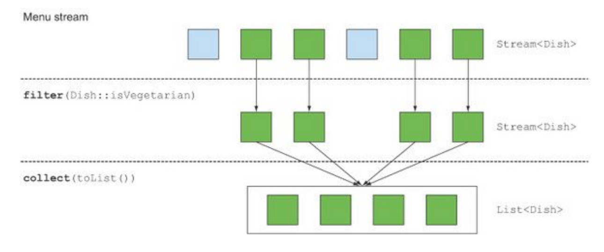

# Streams

## 什么是Streams

Streams是一种用来操作集合中数据以一种声明的方式！你可以把它想象成一个集合的迭代器，除此之外，Streams可以用平行的方式进行，你不需要去写一些线程并发的代码！

```java
public class StreamOpration {
	public static void main(String[] args) {
	  List<Dishes> menu = Arrays.asList(new Dishes(100, "红烧排骨","food"),
	    		new Dishes(20, "可乐","drink"),
	    		new Dishes(40, "米饭","food"),
	    		new Dishes(120, "鸡柳","food"),
	    		new Dishes(200, "满汉全席","food"));
		List<String> collect = menu.stream()
				.filter(d -> d.getCalorious() > 40)
				.sorted(Comparator.comparing(Dishes::getCalorious))
				.map(Dishes::getName)
				.collect(Collectors.toList());
		collect.forEach(System.out::println);
	}
}
```

如果想用并行的方式来执行这段代码，只需要将***stream()*** 换成***parallelStream()*** 

```java
List<String> collect2 = menu.parallelStream()
				.filter(d -> d.getCalorious() > 40)
				.sorted(Comparator.comparing(Dishes::getCalorious))
				.map(Dishes::getName)
				.collect(Collectors.toList());
		collect2.forEach(System.out::println);
```

你可能在想当我们使用parallelStream()的时候，发生了什么呢？我们会使用多少线程来啊完成任务呢？这种方式的好处是什么呢？

这种方式我们用声明的方式来写代码，我们根据自己的需要去实现一个操作

**Chaining stream operations forming a stream pipeline**


因为这些操作例如filter都是high-level building block，所以他们不依赖于特殊的线程模型，他们的核心实现可以是单线程的或者是结构中的最多线程数，这意味着我们在实际应用的时候不需要去考虑线程和锁的问题，streams已经帮我们做好了！

```java
Map<String, List<Dishes>> collect3 = menu.stream().collect(Collectors.groupingBy(Dishes::getType));
		collect3.forEach((k,v) -> {System.out.println(k);
			v.forEach(g -> System.out.println(g.getName()));
		});
```

这个例子就是我们根据Dishes的类型类进行分组！

使用java8的streams我们可以

1. **声明式编程**：可读性和简洁
2. **组合式的架构**：更加灵活
3. **并行**：更好的性能

优化案例

```java

public class Dishes{
	private int calorious;
	
	private String name;
	
	
	private Type type;
	
	public Type getType() {
		return type;
	}
	public void setType(Type type) {
		this.type = type;
	}
	public Dishes(int calorious, String name, Type type) {
		super();
		this.calorious = calorious;
		this.name = name;
		this.type = type;
	}
	public int getCalorious() {
		return calorious;
	}
	public void setCalorious(int calorious) {
		this.calorious = calorious;
	}
	public String getName() {
		return name;
	}
	public void setName(String name) {
		this.name = name;
	}

	public Dishes() {
		super();
	}
	public Dishes(int calorious, String name) {
		super();
		this.calorious = calorious;
		this.name = name;
	}
	public int compareing(Dishes d1,Dishes d2) {
		return d1.getCalorious() - d2.getCalorious();
	}
}
    enum Type{
	DRINK,
	FOOD
}

```

```java
public class StreamOpration {
	public static void main(String[] args) {
//		List<Dishes> menu = new ArrayList<Dishes>();
//		menu.add(new Dishes(100, "红烧排骨","food"));
//		menu.add(new Dishes(20, "可乐","drink"));
//		menu.add(new Dishes(40, "米饭","food"));
//		menu.add(new Dishes(120, "鸡柳","food"));
//		menu.add(new Dishes(200, "满汉全席","food"));
	    List<Dishes> menu = Arrays.asList(new Dishes(100, "红烧排骨",Type.FOOD),
	    		new Dishes(20, "可乐",Type.DRINK),
	    		new Dishes(40, "米饭",Type.FOOD),
	    		new Dishes(120, "鸡柳",Type.FOOD),
	    		new Dishes(200, "满汉全席",Type.FOOD));
		List<String> collect = menu.stream()
				.filter(d -> d.getCalorious() > 40)
				.sorted(Comparator.comparing(Dishes::getCalorious))
				.map(Dishes::getName)
				.collect(Collectors.toList());
		collect.forEach(System.out::println);
		List<String> collect2 = menu.parallelStream()
				.filter(d -> d.getCalorious() > 40)
				.sorted(Comparator.comparing(Dishes::getCalorious))
				.map(Dishes::getName)
				.collect(Collectors.toList());
		collect2.forEach(System.out::println);
		Map<Type, List<Dishes>> collect3 = menu.stream().collect(Collectors.groupingBy(Dishes::getType));
		collect3.forEach((k,v) -> {System.out.println(k);
			v.forEach(g -> System.out.println(g.getName()));
		});
	}
}

```

## Getting start with streams

​	我们开始来讨论streams是从集合Collection开始的，因为这是我们使用Streams的最简单的方式，在java8 的java.util.stream.Stream包中，在后面的章节中你也可以看到streams的各种各样的用法！

​	究竟什么是Streams？一个简短确切的描述就是：一系列的数据处理操作（a sequence of element from a source that support datas processing opration）


 除此之外，Stream还有两个重要的特性

- 管道传输：许多的Stream操作返回的是本身，可以链式的进行下面的操作
- 内部迭代：集合的构造，可以使用迭代器来循环数据

示例：

```java
		List<String> collect = menu.stream()
				.filter(d -> d.getCalorious() > 300)
				.sorted(Comparator.comparing(Dishes::getCalorious))
				.map(Dishes::getName)
				.limit(2)
				.collect(Collectors.toList());

            List<PipedWriter> p = new ArrayList<>();
            p.stream().distinct().peek(
                   a ->  System.out.println("") //做外部处理 无返回值
            ).map((a) -> {
                return a.getClass();  //匹配PipedWriter中的字段挑选出来
            }).limit(100).collect(Collectors.toCollection(LinkedList::new));
```


## Streams 和 Collections

​	举个例子，我们有一个电影存储在DVD中，这是一个集合，因为所有的数据都保存在DVD中，现在我们将数据通过网络以数据流的方式获取，我们只需要先下载我们正在看的这一部分数据！


### 遍历一次

注意，与迭代器类似，流只能遍历一次。在那之后，一个流就被消耗掉了。您可以从初始数据源获取一个新的流来再次遍历它，就像迭代器一样(假设它是一个可重复的源，比如一个集合;如果是I/O通道，那就太不幸了)。例如，下面的代码将抛出一个异常，指示流已被消费:

~~~java
        List<String> list = Arrays.asList("1","2","3","4");
        Stream<String> stream = list.stream();
        stream.forEach(System.out::print);
        stream.forEach(System.out::print);
~~~

所以记住这一点，一个流只能被消费一次。

流和集合另一个关键的不同是在于它们如何管理数据上的迭代。

### 流和集合的不同区别

使用Collection接口需要用户进行迭代(例如，使用for-each);这称为外部迭代。相比之下，Streams库使用内部迭代——它为您执行迭代，并负责将结果流值存储在某个地方;您只需提供一个函数来说明要做什么。下面的代码清单说明了这种差异。

~~~java
        for (String string : list) {
            System.out.print(string);
        }
~~~

这正是您每天对Java集合所做的。您在外部迭代一个集合，显式地逐个提取和处理项。如果你能告诉Sofia，“把地板上所有的玩具都放到盒子里。”“有内部迭代比其他两个原因:首先,索非亚可以选择同时娃娃用一只手和球,第二,她可以决定采取最接近的对象框,然后其他人。同样，使用内部迭代，可以透明地并行完成项的处理，也可以按不同的顺序进行优化。如果您像在Java中那样在外部迭代集合，那么这些优化将是困难的。这可能看起来像是吹毛求疵，但它在很大程度上是Java 8引入流的核心——流库中的内部迭代可以自动选择数据表示和并行性的实现来匹配您的硬件。相比之下，一旦您通过为-each编写代码来选择了外部迭代，那么您基本上就可以自行管理任何并行性了。(在实践中，自我管理意味着“某天我们将并行化它”或“开始一场涉及任务和同步的漫长而艰巨的战斗”。)Java 8需要一个像Collection这样的接口，但是没有迭代器，因此流!图4.4说明了流(内部迭代)和集合(外部迭代)之间的区别。


我们已经描述了集合和流之间的概念差异。具体来说，流利用内部迭代:迭代为您处理。但是，只有当您有一组要使用的预定义操作(例如，过滤器或映射)来隐藏迭代时，这才是有用的。大多数这些操作都将lambda表达式作为参数，因此您可以对它们的行为进行参数化，正如我们在前一章中所展示的那样。Java语言设计人员为Streams API提供了一个广泛的操作列表，您可以使用这些操作来表达复杂的数据处理查询。

### Stream操作


你可以使用两种类型的Stream操作

1.过滤，限制数据调条数等操作数据管道，形成一个pipeline

2.收集方法可以执行管道，并关闭管道


中间操作(如筛选或排序)返回另一个流作为返回类型。这允许将操作连接起来以形成查询。重要的是，在流管道上调用终端操作之前，中间操作不会执行任何处理——它们是惰性的。这是因为中间操作通常可以被终端操作合并并处理为一个单独的传递。

~~~java
        List<Dishes> menu = Arrays.asList(new Dishes(100, "红烧排骨",Type.FOOD),
                new Dishes(20, "可乐",Type.DRINK),
                new Dishes(40, "米饭",Type.FOOD),
                new Dishes(120, "鸡柳",Type.FOOD),
                new Dishes(200, "满汉全席",Type.FOOD));

        menu.stream().filter(a -> {
            System.out.println("filter:"+ a.getCalorious());
            return a.getCalorious() > 40;
        }).map( a -> {
            System.out.println("map:"+ a.getName());
            return a.getName();
        }).limit(3).collect(Collectors.toList());
~~~

运行结果：

~~~properties
filter:100
map:红烧排骨
filter:20
filter:40
filter:120
map:鸡柳
filter:200
map:满汉全席
~~~

由于流的惰性，你可以注意到这几个优化，首先很多菜的卡路里都超过了40，只有超过40的才会被选上，尽管filter和map是两个独立的操作，但他们被合并到一个pass中（技术循环融合）。

### 终端操作

终端操作通过流管道产生结果。结果是任何非流值，如列表、整数甚至void。例如，在下面的管道中，forEach是一个终端操作，它返回void并对源中的每个盘子应用lambda。

~~~java
collect.stream().forEach(System.out::println);
~~~

终端操作可以返回List，Integer，甚至是void，这样的的操作就是终端操作。

### 总结：

1.stream是一个序列的元素支持的数据处理操作

2.stream使用内部迭代来操作数据，抽象出来筛选映射和排序等操作提供操作数据

3.有两种操作。中级操作和终端操作

4.使用过滤和匹配等方法可以返回一个流，用于搭建管道

5.终端操作用于返回数据和结果

# 使用Streams

在前面，我们知道了Streams可以使用内部循环来代替for外部循环，可以不用去管理一个循环操作。我们可以使用streams的API来操作数据，你所需要的就仅仅是定义数据操作的流程。

## 过滤和切片

### Filter with a predicate

Streams接口提供了filter的方法，参数为predicate类型的对象（一个返回boolean值的方法），返回Stream包括所有满足条件的元素。

~~~java
Predicate<Dishes> dishesPredicate = a -> "可乐".equals(a.getName());
menu.stream().filter(dishesPredicate).collect(Collectors.toList()).forEach(System.out::println);
~~~



### 过滤去重

~~~java
        menu.stream().filter(a -> a.getCalorious() > 100)
                .distinct()
                .collect(Collectors.toList());
~~~

### 截取Stream

~~~java
        menu.stream().filter(a -> a.getCalorious() > 100)
                .limit(2)
                .collect(Collectors.toList());
~~~

注意，limit也可以适用于无序流。

~~~java
        Set<Dishes> set = new HashSet<>();
        set.add(new Dishes(100, "红烧排骨",Type.FOOD));
        set.add(new Dishes(20, "可乐",Type.DRINK));
        set.add(new Dishes(40, "米饭",Type.FOOD));
        Set<Dishes> collect1 = set.stream().filter(a -> a.getCalorious() > 10)
                .limit(2)
                .collect(Collectors.toSet());
        collect1.forEach(a -> System.out.println(a.getName()));
~~~

### 跳过元素

skip方法会跳过前面n个元素，如果元素数量小于呢，那么就会返回空的Stream，注意skip和limit可以配套使用，

~~~java
        List<Dishes> dishes = menu.stream().filter(a -> a.getCalorious() > 100)
                .limit(3)
                .skip(1)
                .collect(Collectors.toList())	
          
~~~

## Mapping

就像是我们在SQL查询中，从所有数据中查询特定的字段，Mapping就是这样的一个方法，是我们从流中获取特定的数据！

### map

~~~java
        List<String> collect2 = menu.stream()
                .map(Dishes::getName)
                .collect(Collectors.toList());
~~~

Streams支持函数作为参数的映射，该函数作用与每个元素，将其映射到一个新的元素。

~~~java
        List<Integer> collect2 = menu.stream()
                .map(Dishes::getName)
                .map(String::length)
                .collect(Collectors.toList());
~~~

上面的例子我们可以看到使用map获得的结果我们可以对map后的结果进行操作，继续使用map获取特定数据！

### flatmap

~~~java
        List<String> collect3 = strings.stream().map(string -> string.split(""))
                .flatMap(Arrays::stream)
                .distinct()
                .collect(Collectors.toList());
~~~

flatmap方法可以使所有独立的流合并为一个流。


## Finding  and matching

### match

```java
boolean b = menu.stream().anyMatch(a -> a.getType() == Type.DRINK);
```

使用match函数可以使我们寻找特定类型的数据时候在集合中存在！

这里有三种类型的函数供我们使用allMatch，anyMatch，noneMatch。

### finding an element

finfAny可以返回当前流的任意元素

~~~java
        Optional<Dishes> any = menu.stream().filter(a -> a.getType() == Type.DRINK)
                .findAny();
~~~

### Optional 

Optional是一个容器类，用于表示值的存在与不存在，它有几个重要的方法

isPresent():如果容器中存在值就返回true

T get():如果容器中存在就返回值，为空则返回NoMuchElement-Exception

T orElse():if - else 模式

~~~java
        Dishes dish = new Dishes(100, "红烧排骨",Type.FOOD);
        Dishes dishes1 = Optional.ofNullable(dish).orElse(face.getAll());
~~~

## Reducing

###  Summing the element

~~~java
        List<Integer> integers = Arrays.asList(4,3,5,9);
        Integer reduce = integers.stream().reduce(10, new BinaryOperator<Integer>() {
            @Override
            public Integer apply(Integer integer, Integer integer2) {
                return integer + integer2;
            }
        });
        System.out.println(reduce);
        //同样的效果
        integers.stream().reduce(0,Integer::sum);
~~~


reduce方法用于累加获得总体结果：

```java
int accResult = Stream.of(1, 2, 3, 4).reduce(0 ,(acc , item ) -> {  //0为累加的起始值
	System.out.println("acc:"+acc);                                
	System.out.println("item:"+item);                              
	return acc+=item;                                              
});                                                                
```

