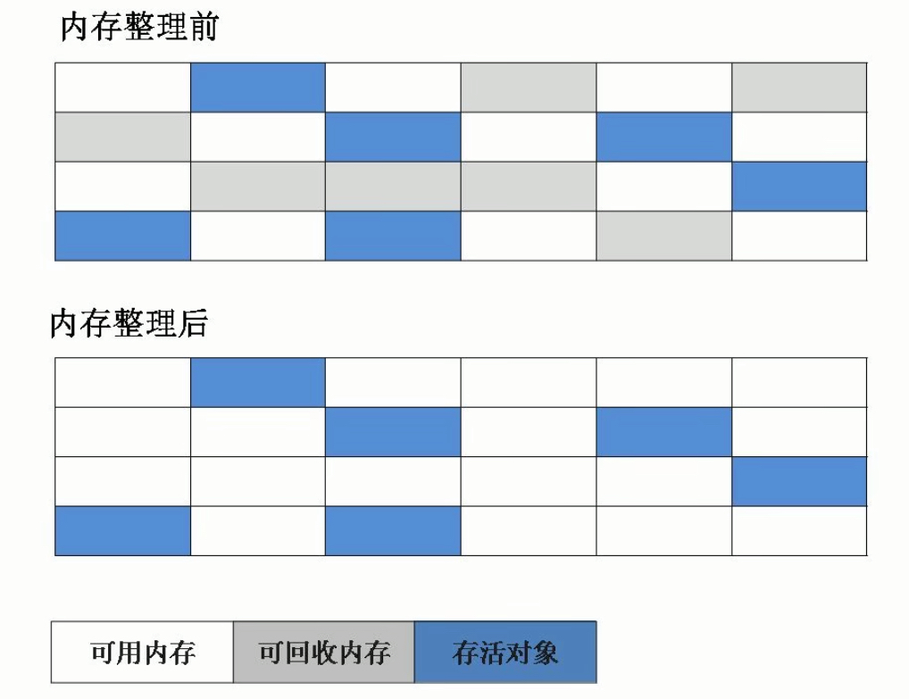
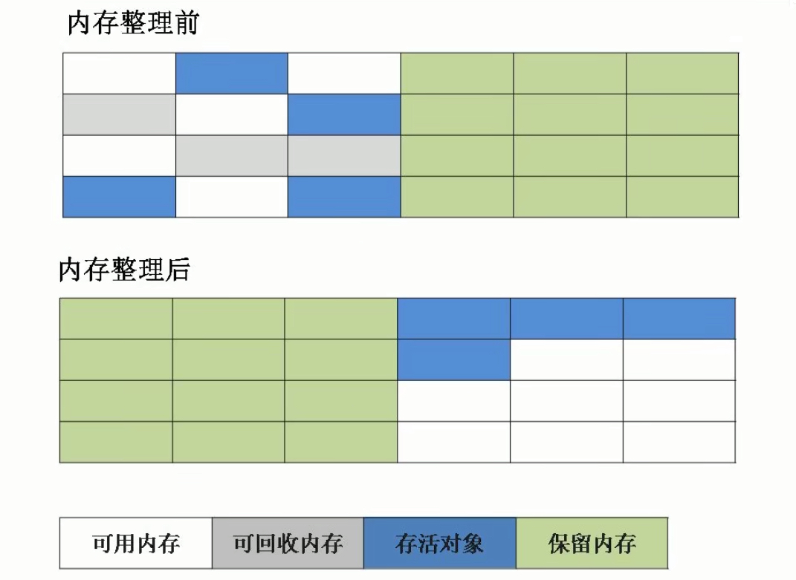
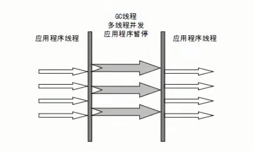
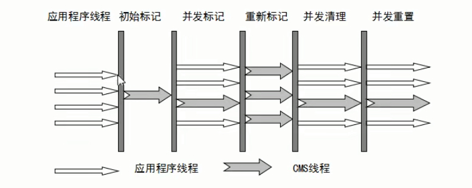
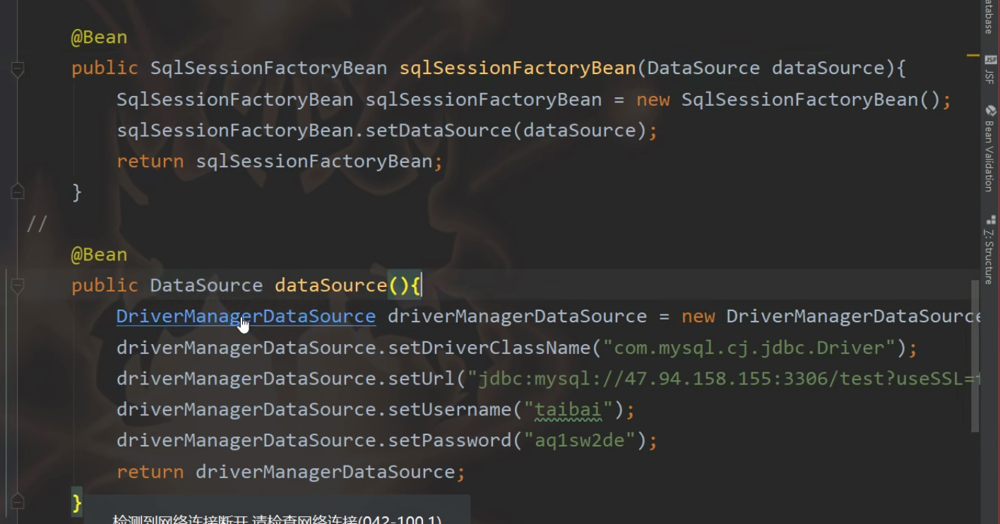

# java底层原理

### JVM

#### GC算法和收集器（ZGC）

一个对象如果没有引用的点，那样就会被回收

~~~java
public class User {
    @Override
    protected void finalize() throws Throwable {
        System.out.println("对象即将被回收 ， 引用finalize方法！");
    }
}
~~~

当一个对象即将被回收的时候，会引用finalize方法，如果我们在finalize方法中将对象赋值给变量，这样就避免了对象被回收！

#### 标记清除算法

这是最基础的算法，这个算法分为两个阶段，“标记和清除”，首先标记出所有需要回收的对象，在标记完成后统一回收所有被标记的对象，但是有两个不足的地方

1. 效率问题，标记和清除的两个过程效率都不高
2. 空间问题，标记清除后会产生大量不连续的碎片



需要扫整个内存来判断是否为活跃内存！

#### 复制算法

为了解决标记清除算法的效率问题，出现了复制算法，它可以将内内存分为大小相同的两块，每次使用其中的一块，当这一块是用完后，将存活的对象复制到另一块，这样每次回收内存区间的一半！


#### 标记整理算法

根据老年代的特点提出的一种标记算法，标记过程和标记清除一样，但是后续步骤不是对可回收对象进行回收有存活的对象，然后清理边界以外的内存



分代收集算法


#### Parallel Scavenge收集器（java8）

新生代采用复制算法，老年代使用标记-整理算法



#### CMS算法

1. 初始标记：暂停所有的其他线程，并记录直接与root相连的对象，速度很快
2. 并发标记：同时开启GC和用户线程，用一个闭包结构去记录可达的对象，但在这个阶段结束
3. 重新标记：
4. 并发清除：



优点：并发收集，停顿低

缺点

- 对CPU资源敏感
- 无法处理浮动垃圾
- 使用标记-清除算法，产生大量空间碎片

#### G1收集器

G1收集器是一款面向服务器的垃圾收集器，设置垃圾回收停顿！服务器端常使用的垃圾收集器！

#### 调优

JVM调优主要使用下面两个指标：

- 停顿时间：垃圾收集器做垃圾回收时间与中断应用执行时间：-XX：MaxGCPauseMillis

- 吞吐量：垃圾收集的时间和总时间的占比：1/n+1 ，吞吐量为1-1/n+1 ：-XX：GCTimeTatio=99

#### GC调优步骤

1. 打印GC日志 

   ```java
   -XX:+PrintGCDateStamps -XX:+PrintGCDetails -Xloggc:./gclogs
   //tomcat可以直接加载JAVA_OPST变量里
   ```

2. 使用GC工具来分析GC！工具：GCeasy

3. 分析GC日志，通过吞吐量和停顿时间来进行调优

### Spring-mybatis



初始化SQLSessionFactory

mybatis注解：执行SQL

**building SqlSessionFactory without XML**

~~~java
DataSource dataSource = BlogDataSourceFactory.getBlogDataSource();
//得到一个数据源
TransactionFactory transactionFactory =new JdbcTransactionFactory();
//配置事务管理
Environment environment = new Environment("development", transactionFactory, dataSource);
//得到系统环境 mybatis系统环境
Configuration configuration = new Configuration(environment);
//配置对象 ， 可以进行配置mybatis属性（例如日志，）
configuration.addMapper(BlogMapper.class);
//将mapper中的方法存入Map灯带使用
SqlSessionFactory sqlSessionFactory = new SqlSessionFactoryBuilder().build(configuration);
//实例化整个sqlSessionFactory

SqlSessionFactory session = null;
session = sqlSessionFactory.openSession();
TDao tdao = session.getMapper(TDao.class);
//这里面TDao是接口，而tdao是对象。用代理设计模式，jdk动态代理就是提供一个接口，
//为什么一个接口可以产生一个对象，使用jdk动态代理
//使用动态代理可以将接口的方法进行实现，在调用动态代理的时候可以实例化这个接口的实现类
//在接口的方法执行时可以执行InvocationHandler中的方法
//执行SQL语句的方法就是InvocationHndler中的invoke方法
tdao.list();
~~~

#### Spring的原理-把产生的代理对象注入到容器

将Dao注入到Spring容器中，那么如何将代理的Dao对象注入到Spring容器中？

**@Service和@Compent——将一个类交给Spring管理，然后Spring去实例化对象**：**没办法控制对象的产生过程**

将对象交给Spring管理：

@Bean ， api registerSingleten ， factoryBean ， 

使用Spring的API来进行对象的注入

~~~java
        AnnotationConfigApplicationContext context = new AnnotationConfigApplicationContext(User.class);
        ConfigurableListableBeanFactory beanFactory = context.getBeanFactory();
        beanFactory.registerSingleton("user" , new User());
~~~

~~~java
        AnnotationConfigApplicationContext context = new AnnotationConfigApplicationContext();
        //在容器中注册类
        context.register(User.class);
        
        //执行这个方法之后真正的初始化容器了
        context.refresh();
        ConfigurableListableBeanFactory beanFactory = context.getBeanFactory();
        beanFactory.registerSingleton("user" , new User());
~~~

factoryBean是一种特殊的bean，需要实现FactoryBean接口，重写里面的三个方法!

~~~java
@Component   
//使用注解，这个FactoryBeanTest在容器中，同时getObject方法返回的Object也在容器中
class FactoryBeanTest implements FactoryBean{

        @Override
        public Object getObject() throws Exception {
          //需要返回一个对象
            return null;
        }

        @Override
        public Class<?> getObjectType() {
            return null;
        }

        @Override
        public boolean isSingleton() {
            return false;
        }
    }
}
~~~

将单个注解注入到Spring容器中

~~~xml
	<bean id = "user" class="org.apache.rocketmq.console.util.Main.FactoryBeanTest">
		<property name="user" value="userDao"></propertyname>
	</bean>
	
~~~

使用XML配置文件来进行Bean的注入，在注入时我们可以指定Bean属性值

#### @MapperScan

如果使用XML配置Mapper，一次只能注入一个，在注入多个时，保证factoryBean生效

这时我们使用@Service，我们没有地方注入MapperInterface

通过Spring拓展：，把类交给Spring管理，

- class - beanDefination - putMap - new - bean

~~~java
    class BeanTest implements ImportBeanDefinitionRegistrar{

      //AnnotationMetadata 注解的元数据
        @Override
        public void registerBeanDefinitions(AnnotationMetadata annotationMetadata, BeanDefinitionRegistry beanDefinitionRegistry) {
            //将这个类的信息获取到
            BeanDefinitionBuilder buider = BeanDefinitionBuilder.genericBeanDefinition(Main.FactoryBeanTest.class);
            //获取类的各种信息
            AbstractBeanDefinition beanDefinition = buider.getBeanDefinition();
            beanDefinition.getPropertyValues().add("interClass" , User.class);

            //Spring会来实例化这个Bean
            beanDefinitionRegistry.registerBeanDefinition("test" , beanDefinition);
        }
    }
~~~


~~~java
    @Retention(RetentionPolicy.RUNTIME)
    @Import(BeanTest.class)
    public @interface MapperScan{
        String value();
    }
~~~

