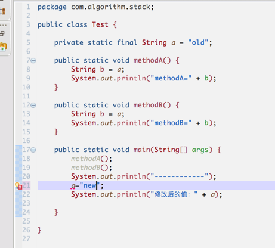

## java修饰词

---

#### 1.volatile介绍


volatile是java最轻量级的同步机制。

**特性：**

*	可见性。变量读写直接操作主存而不是CPU Cache。当一个线程修改了volatile修饰的变量后，无论是否加锁，其它线程都可以立即看到最新的修改。
*	禁止指令重排序优化。
*	保证变量可见性，但无法保证原子性。也就是说非线程安全

##### java内存模型：


[深入分析volatile的实现原理](https://mp.weixin.qq.com/s/mcR8_FHHGA2zb0aW1N02ag?from=groupmessage&isappinstalled=0)

#### 2.synchronized介绍

线程安全，锁区域内容一次只允许一个线程执行，通过锁机制控制。

```
     一、当两个并发线程访问同一个对象object中的这个synchronized(this)同步代码块时，一个时间内只能有一个线程得到执行。另一个线程必须等待当前线程执行完这个代码块以后才能执行该代码块。

     二、然而，当一个线程访问object的一个synchronized(this)同步代码块时，另一个线程仍然可以访问该object中的非synchronized(this)同步代码块。

     三、尤其关键的是，当一个线程访问object的一个synchronized(this)同步代码块时，其他线程对object中所有其它synchronized(this)同步代码块的访问将被阻塞。
```


* 同步方法

```
public synchronized void method(int i);  
```

每个类实例对应一把锁，类的两个实例没有这个限制。类实例中所有的synchronized方法共用这一把锁，锁的范围有点大。


* 同步块

相比上面的同步方法，锁的范围可缩小。


```
synchronized(syncObject) {  
//允许访问控制的代码  
}  
```

其中的代码执行前必须获得对象 syncObject 锁，可以针对任意代码块，且可任意指定上锁的对象，故灵活性较高。

#### 3.final介绍

如果修饰变量标识为常量，运行过程中会将值直接替换到变量这个占位符中（避免根据内存地址再次查找这层消耗）；如果修改方法，方法不允许被覆盖；修饰类，类不允许被继承。

基础类型，如String，不允许修改。

集合，如Map、List，引用地址不允许改，但可以put、get等操作。

java8编译会检查，如果是修改常量，会编译失败。




#### 4.static

* 声明属性

	为全局属性，放在全局数据区，只分配一次
* 声明方法

	类方法，可以由类名称直接调用
	
* 声明类
	
#### 5.transient
	
如果一个对象中的某个属性不希望被序列化，则可以使用transient关键字进行声明。


	