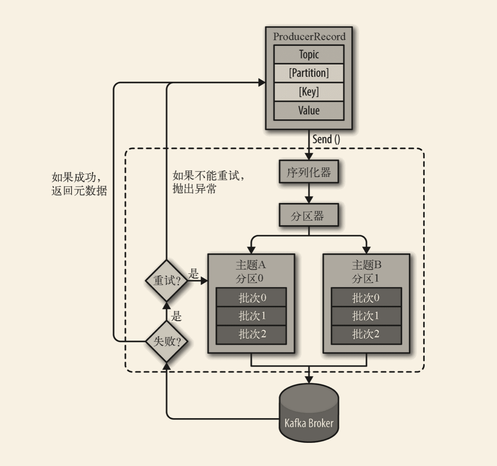

# kafka

## 生产者



“我们从创建一个 ProducerRecord 对象开始，ProducerRecord 对象需要包含目标主题和要发送的内容。我们还可以指定键或分区。在发送 ProducerRecord 对象时，生产者要先把键和值对象序列化成字节数组，这样它们才能够在网络上传输。

接下来，数据被传给分区器。如果之前在 ProducerRecord 对象里指定了分区，那么分区器就不会再做任何事情，直接把指定的分区返回。如果没有指定分区，那么分区器会根据 ProducerRecord 对象的键来选择一个分区。选好分区以后，生产者就知道该往哪个主题和分区发送这条记录了。紧接着，这条记录被添加到一个记录批次里，这个批次里的所有消息会被发送到相同的主题和分区上。有一个独立的线程负责把这些记录批次发送到相应的 broker 上。”

“服务器在收到这些消息时会返回一个响应。如果消息成功写入 Kafka，就返回一个 RecordMetaData 对象，它包含了主题和分区信息，以及记录在分区里的偏移量。如果写入失败，则会返回一个错误。生产者在收到错误之后会尝试重新发送消息，几次之后如果还是失败，就返回错误信息。”

### 创建kafka生产者

创建kafka生产者对象，三个必要属性：

- **bootstrap.servers** 

  该属性指定 broker 的地址清单，地址的格式为 host:port。清单里不需要包含所有的 broker 地址，生产者会从给定的 broker 里查找到其他 broker 的信息。不过建议至少要提供两个 broker 的信息，一旦其中一个宕机，生产者仍然能够连接到集群上。

- **key.serializer**

  生产者接口允许使用参数化类型，因此可以把 Java 对象作为键和值发送给 broker

- **value.serializer**

  与 key.serializer 一样，value.serializer 指定的类会将值序列化。


```java
private Properties kafkaProps = new Properties(); 
kafkaProps.put("bootstrap.servers", "broker1:9092,broker2:9092");
kafkaProps.put("key.serializer",
  "org.apache.kafka.common.serialization.StringSerializer"); 
kafkaProps.put("value.serializer",
  "org.apache.kafka.common.serialization.StringSerializer");
producer = new KafkaProducer<String, String>(kafkaProps); 
```

实例化对象后，我们可以使用三种方式来发送消息

1. 发送并忘记

   我们把消息发送给服务器，但并不关心消息是否到达。

2. 同步发送

   我们使用 send() 方法发送消息，它会返回一个 Future 对象，调用 get() 方法进行等待，就可以知道消息是否发送成功。

3. 异步发送

   我们调用 send() 方法，并指定一个回调函数，服务器在返回响应时调用该函数。


为了在异步发送消息的同时能够对异常情况进行处理，生产者提供了回调支持。

```java
private class DemoProducerCallback implements Callback {
        @Override
    public void onCompletion(RecordMetadata recordMetadata, Exception e) {
     if (e != null) {
         e.printStackTrace(); 
        }
    }
}

ProducerRecord<String, String> record =
        new ProducerRecord<>("CustomerCountry", "Biomedical Materials", "USA"); 
producer.send(record, new DemoProducerCallback()); 
```

### 生产者的配置

- acks

  acks 参数指定了必须要有多少个分区副本收到消息，生产者才会认为消息写入是成功的。

  ack=0 : 不等待服务器返回 ack=1:只要leader收到节点消息，生产者就会收到返回 ack=all

  全部参与复制的节点都收到消息，生产者就会得到服务器的成功相应

- buffer.memery

  该参数用于设置生产者内存缓冲区的大小，生产者用它缓存要发送到服务器的消息

- compression.type

- retries

  生产者收到错误后重试的次数

- batch.size

  当有多个消息需要被发送到同一个分区时，生产者会把它们放在同一个批次里。

- linger.ms

  “该参数指定了生产者在发送批次之前等待更多消息加入批次的时间。KafkaProducer 会在批次填满或 linger.ms 达到上限时把批次发送出去。”

- client.id

  该参数指定了生产者在发送批次之前等待更多消息加入批次的时间。KafkaProducer 会在批次填满或 linger.ms 达到上限时把批次发送出去。

- max.in.flight.requests.per.connection

  该参数指定了生产者在收到服务器响应之前可以发送多少个消息。它的值越高，就会占用越多的内存，不过也会提升吞吐量。把它设为 1 可以保证消息是按照发送的顺序写入服务器的，即使发生了重试。

- timeout.ms、request.timeout.ms 和 metadata.fetch.timeout.ms

  request.timeout.ms 指定了生产者在发送数据时等待服务器返回响应的时间，metadata.fetch.timeout.ms 指定了生产者在获取元数据（比如目标分区的首领是谁）时等待服务器返回响应的时间。

- max.block.ms

  该参数指定了在调用 send() 方法或使用 partitionsFor() 方法获取元数据时生产者的阻塞时间。当生产者的发送缓冲区已满，或者没有可用的元数据时，这些方法就会阻塞。在阻塞时间达到 max.block.ms 时，生产者会抛出超时异常。

- max.request.size

  该参数用于控制生产者发送的请求大小。它可以指能发送的单个消息的最大值，也可以指单个请求里所有消息总的大小。例如，假设这个值为 1MB，那么可以发送的单个最大消息为 1MB，或者生产者可以在单个请求里发送一个批次，该批次包含了 1000 个消息，每个消息大小为 1KB。另外，broker 对可接收的消息最大值也有自己的限制（message.max.bytes），所以两边的配置最好可以匹配，避免生产者发送的消息被 broker 拒绝。

- receive.buffer.bytes 和 send.buffer.bytes

  这两个参数分别指定了 TCP socket 接收和发送数据包的缓冲区大小。如果它们被设为 -1，就使用操作系统的默认值。如果生产者或消费者与 broker 处于不同的数据中心，那么可以适当增大这些值，因为跨数据中心的网络一般都有比较高的延迟和比较低的带宽。


#### 顺序保证

Kafka可以保证在一个分区内消息是有序的，一般来说，如果某些场景要求消息是有序的，那么消息是否写入成功也是很关键的，所以不建议把 retries 设为 0。可以把 max.in.flight.requests.per.connection 设为 1，这样在生产者尝试发送第一批消息时，就不会有其他的消息发送给 broker。

### 序列化器

#### 自定义序列化器

```java
public class CustomerSerializer implements Serializer<Customer> {

    @Override
    public void configure(Map configs, boolean isKey) {
        // 不做任何配置
    }

    @Override
    /**
     Customer对象被序列化成：
     表示customerID的4字节整数
     表示customerName长度的4字节整数（如果customerName为空，则长度为0）
     表示customerName的N个字节
     */
    public byte[] serialize(String topic, Customer data) {
        try {
            byte[] serializedName;
            int stringSize;
            if (data == null)
                return null;
            else {
                if (data.getName() != null) {
                    serializedName = data.getName().getBytes("UTF-8");
                    stringSize = serializedName.length;
                } else {
                    serializedName = new byte[0];
                    stringSize = 0;
                }
            }
            ByteBuffer buffer = ByteBuffer.allocate(4 + 4 + stringSize);
            buffer.putInt(data.getID());
            buffer.putInt(stringSize);
            buffer.put(serializedName);

            return buffer.array();
        } catch (Exception e) {
            throw new SerializationException("Error when serializing Customer tobyte[] " + e);
        }
    }
    @Override
    public void close() {
        // 不需要关闭任何东西
    }
}
class Customer{
    private int customerID;
    private String customerName;

    public Customer(int ID, String name) {
        this.customerID = ID;
        this.customerName = name;
    }

    public int getID() {
        return customerID;
    }
    public String getName() {
        return customerName;
    }
}
```

#### Avro序列化器

```java
Properties props = new Properties();
props.put("bootstrap.servers", "localhost:9092");
props.put("key.serializer",
   "io.confluent.kafka.serializers.KafkaAvroSerializer");
props.put("value.serializer",
   "io.confluent.kafka.serializers.KafkaAvroSerializer"); ➊
props.put("schema.registry.url", schemaUrl); ➋

String topic = "customerContacts";

Producer<String, Customer> producer = new KafkaProducer<String,
   Customer>(props); ➌

// 不断生成事件，直到有人按下Ctrl+C组合键
while (true) {
    Customer customer = CustomerGenerator.getNext();
    System.out.println("Generated customer " +
       customer.toString());
    ProducerRecord<String, Customer> record =
                        new ProducerRecord<>(topic, customer.getId(), customer); ➍
    producer.send(record); ➎
}
```

❶ 使用 Avro 的 KafkaAvroSerializer 来序列化对象。注意，AvroSerializer 也可以处理原语，这就是我们以后可以使用字符串作为记录键、使用客户对象作为值的原因。

❷ schema.registry.url 是一个新的参数，指向 schema 的存储位置。

❸ Customer 是生成的对象。我们会告诉生产者 Customer 对象就是记录的值。

❹ 实例化一个 ProducerRecord 对象，并指定 Customer 为值的类型，然后再传给它一个 Customer 对象。

❺ 把 Customer 对象作为记录发送出去，KafkaAvroSerializer 会处理剩下的事情。

### 分区

```java
/**
 * Created by biwh on 2021/7/15.
 */
public class BananaPartitioner implements Partitioner {

    public void configure(Map<String, ?> configs) {}

    public int partition(String topic, Object key, byte[] keyBytes,
                         Object value, byte[] valueBytes,
                         Cluster cluster) throws InvalidRecordException {
        List<PartitionInfo> partitions =
                cluster.partitionsForTopic(topic);
        int numPartitions = partitions.size();

        if ((keyBytes == null) || (!(key instanceof String)))
        throw new InvalidRecordException("We expect all messages to have customer name as key");

        if (((String) key).equals("Banana"))
        return numPartitions; // Banana总是被分配到最后一个分区
        // 其他记录被散列到其他分区
        return (Math.abs(Utils.murmur2(keyBytes)) % (numPartitions - 1))
    }

    public void close() {}
}
```

